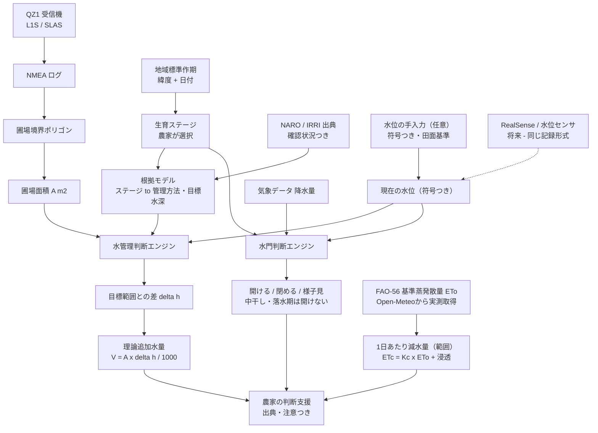

# スイスイナビ（水門ナビ / Suimon Navi）

**QZSS（みちびき）測位で水田を実測し、生育ステージにもとづく水管理を根拠つきで支援するWebアプリ。**

準天頂衛星「みちびき」ハッカソン出展作品 — チームE、奈良高専（KAI、個人参加）。
全体計画：[`Suimon_Navi_Plan.pptx`](./Suimon_Navi_Plan.pptx)

---

## 30秒でわかる (In one minute)

| | |
|---|---|
| **課題** | 水田の水管理は生育とともに変わり、圃場ごとの判断が必要。実在する友人の祖父の水田は手動水門で、開閉判断は経験と勘に依存している。 |
| **入力** | QZSS/GNSSで実測した圃場境界（水位・生育ステージの入力は任意） |
| **処理** | 農学的根拠モデル（生育ステージ → 管理方法・目標水深）＋ 圃場ジオメトリ |
| **出力** | 推奨水深 → （任意で水位入力）→ 必要水量・1日あたり減水量・水門の開閉判断（すべて出典つき） |
| **将来** | RealSense水位計測 ／ 気象・蒸発散(ETc) ／ 水門自動制御 |

このアプリは**意思決定支援**であり、自動化システムではありません。実際の水門操作は農家が行います。

---

## 地域課題 (The problem)

実在する友人の祖父の水田は、手動操作の水門で灌漑されています。開閉タイミングは現在、正確な圃場形状や気象データではなく、農家の長年の経験と勘に頼っています。この判断は高齢の担い手ほど負担が大きく、後継者が同じ精度で判断できる保証もありません — 日々の負担に加えて継承リスクも抱えています。水管理の精度は米の収量・品質に直結するため、今取り組む価値があります。

## 技術の壁 (The technical wall)

**スマホ単体GPS：** 市街地・遮蔽下でのマルチパス誤差により、実際には約5mのずれが生じることがあり、畦や水路など近接する地物を取り違えるリスクがあります。圃場形状を正確に記録するには不向きです。

**QZ1 + みちびきSLAS：** 今回使用できたのは**青いQZ1**受信機（L1S/SLAS）のみで、CLAS受信機は入手できませんでした。GGAのfix quality `2` はDGNSS状態の証拠ですが、それだけで補正方式がSLASだったことや絶対精度を証明はできません。本アプリではfix quality、QZSS可視・使用衛星、HDOP、生NMEAを別々に保存し、SLASの明示状態は受信機側の追加出力が確認できるまで「未確認」と扱います。

**センチメートル精度は主張しません。** 実測できた範囲を正直に記載しています（[実測結果](#実測結果-first-real-world-capture--2026-07-06)）。

---

## システムの仕組み (How the system works)



実線＝実装済み、点線＝将来構想。

### 科学的に重要な区別

```
✗ 圃場面積 → 推奨水深            （誤り。面積は水深を決めない）
✓ 生育ステージ + 栽培条件 → 推奨する管理状態・目標水深
✓ 圃場面積 × 必要な水深変化 → 必要水量
```

2haの水田と2aの水田は、同じ生育ステージなら**同じ目標水深**です。違うのは必要な水量だけ。

### 計算例 (Worked example)

`1 mm の水 × 1 m² = 1 L` という関係だけを使います。

```
圃場面積   2,143 m²      ← QZ1で実測した境界から算出
生育ステージ 移植直後（目標 30–50 mm、やや深水管理）
現在の水位  18 mm
不足        12–32 mm
必要水量    2,143 × 12 / 1000 … 2,143 × 32 / 1000
          = 25.7 〜 68.6 m³ ／ 25,716 〜 68,576 L
根拠        農研機構 図説：生育時期別の一般的な水管理
```

> **この値は「湛水深を変えるのに必要な水量」の理論値です。** 実際の必要用水量は、降雨・蒸発散・浸透・排水・圃場の均平・土壌条件・用水路の効率によって変わります。灌漑量の確定値ではありません。

### QZSS測位が効く理由 (Why QZSS/GNSS matters)

`V = A × Δh` の **A（面積）は、QZ1で歩いて実測した境界から求めた値**です。面積は結果に線形で効くため、境界測位の精度がそのまま水量推定の信頼性になります。上の例では面積が5%ずれると約1.3〜3.4 m³動きます。**測位精度が農業の実務値に直結する** — これが本プロジェクトで測位と水管理を一つのシステムにしている理由です。

---

## 実装状況 (Implementation status)

| 機能 | 状況 |
|---|---|
| NMEAアップロード・GGA解析（fix品質/HDOP/QZSS） | ✅ 実装済み |
| ライブ記録（Web Serial・PC） | ✅ 実装済み |
| GNSS観測からの圃場境界作成 | ✅ 実装済み |
| 圃場面積の算出 | ✅ 実装済み |
| 水位の手入力記録（出典・時刻つき） | ✅ 実装済み |
| 生育ステージ別の水管理推奨 | ✅ 実装済み |
| 必要湛水量の算出 | ✅ 実装済み |
| 出典・確認状況のUI表示 | ✅ 実装済み |
| 降雨にもとづく水門アドバイス | ✅ 実装済み |
| アカウント・クラウド同期（Supabase） | ✅ 実装済み |
| ドローンMAVLinkテレメトリ表示 | ✅ 実装済み（既定はモック、**飛行操作は非実装**） |
| RealSenseによる雑草・害虫検出（Jetson） | 🧪 実験的（Webアプリ未接続） |
| RealSenseによる水位自動計測 | 🗓 将来構想（**未実装**） |
| 符号つき水位（田面基準・負値＝地表面より下） | ✅ 実装済み — [ARCHITECTURE §6](./docs/ARCHITECTURE.md) |
| AWD（間断灌漑）専用の推奨アルゴリズム | 🗓 将来構想 — 計測の表現のみ。AWDの農学的推奨は未実装 |
| 気象連動の蒸発散(ETc)計算 | ✅ 実装済み — Open-MeteoのFAO-56 ETo × FAO56 Kc |
| 1日あたり減水量の推定（範囲表示） | ✅ 実装済み — 理論追加水量とは別表示、誤差±3mm/日を明記 |
| 生育ステージの自動推定（地域標準作期） | ✅ 実装済み — 手動変更が常に優先 |
| 水位・生育ステージを考慮した水門判断 | ✅ 実装済み — 中干し・落水期は絶対に「開ける」と言わない |
| 水門の自動制御 | 🗓 将来構想（意図的にスコープ外） |

物理的な水門の自動化と、ドローンの飛行操作系は、**安全上の理由で意図的にスコープ外**としています。

---

## ドキュメント (Documentation)

| ドキュメント | 内容 |
|---|---|
| [`docs/ARCHITECTURE.md`](./docs/ARCHITECTURE.md) | システム全体構成、QZSSと水量計算の関係、実装状況、既知の課題、拡張点 |
| [`docs/PADDY_WATER_MANAGEMENT.md`](./docs/PADDY_WATER_MANAGEMENT.md) | 水管理モデルの詳細、生育ステージ表、計算、永続化 |
| [`docs/RESEARCH_REFERENCES.md`](./docs/RESEARCH_REFERENCES.md) | 研究・技術資料の書誌情報、出典の確認状況、本プロジェクトでの解釈と限界 |
| [`docs/SATELLITE_ASSURANCE.md`](./docs/SATELLITE_ASSURANCE.md) | Satellite Assuranceの計算根拠・データモデル |
| [`docs/LEAFLET_TECHNIQUES.md`](./docs/LEAFLET_TECHNIQUES.md) | 地図実装の技術メモ |
| [`docs/MAVLINK_OPERATOR_GUIDE.md`](./docs/MAVLINK_OPERATOR_GUIDE.md) | ドローン連携の運用手順・安全制限 |

**根拠の追跡可能性：** 画面に出る数値 → `js/water/water-management-sources.js` の登録 → `docs/RESEARCH_REFERENCES.md` の書誌情報、の順にたどれます。出典を確認できない数値はコードに入れていません。

---

## 技術構成 (Tech stack)

- **フィールド機器：** 青いQZ1 GNSS受信機（L1S/SLAS、Bluetooth SPP）＋ Android Pixel 6a
- **ライブ記録（PC）：** Web Serial API — Chrome/Edgeで仮想シリアルポートとしてNMEAをリアルタイム受信・地図表示・保存
- **地図表示：** Leaflet ＋ Leaflet.markercluster ＋ Turf.js（境界ポリゴンから面積算出）
- **気象データ：** [Open-Meteo](https://open-meteo.com/)（無料・APIキー不要）から水門座標で自動取得。失敗時は `data/weather.json` にフォールバック
- **水管理モデル：** `js/water/` — DOM非依存の純粋モジュール群、ユニットテスト済み
- **アプリ：** プレーンなHTML/CSS/JS、GitHub Pagesでホスティング
- **クラウド：** Supabase（アカウント＋圃場同期）。ローカルストレージが正、同期は追加的

## 使い方 (How to use)

1. HTTP経由で配信します（GitHub Pages、またはローカルで `node scripts/dev-server.mjs` → `http://localhost:4173/`）。
2. **NMEAをアップロード** — QZ1のログ（`.nmea`/`.txt`/`.log`）を読み込みます。緑＝DGNSS fix、オレンジ＝単独測位。
   - PCでのライブ記録は **QZ1ライブ記録** カード（Chrome/Edge、HTTPS or localhost）。
   - スマホはWeb Serial非対応のため、Serial Bluetooth Terminal等でログ保存 → アップロード。
3. 測位点から**圃場境界を作成**すると、面積が自動算出されます。
4. **生育ステージと現在の水位を記録**すると、目標水深との差と必要水量が根拠つきで表示されます。
5. 測位点のタグ付け（水門/畦/水路/圃場の角）、観察メモ、JSONエクスポート/インポートが可能です。

静的データ：`data/field.json`（圃場境界・水路・初期水門位置）、`data/gate_rules.json`（判断しきい値）、`data/weather.json`（初期気象入力）。

### 開発 (Development)

```bash
npm test
```

```bash
npm run test:browser
```

---

## ドローン拡張 (Drone expansion)

機体：Holybro X500 V2。ドローンは自機のGPSで自律飛行し、QZ1をペイロードとして搭載して機内ロギングを行います（着陸後にデータ回収）。機体登録・航空法対応は完了、学校内での試験飛行も許可済み（教員承認・作物のない区域）。水田上空の飛行には祖父の明示的同意と同伴者が必要です — 単独でのフィールドワーク・ドローン飛行はハッカソンのルールで禁止されています。

**MAVLinkテレメトリ連携（実装済み）：** フライトモード・アーム状態・バッテリー・GNSS・姿勢・方位を表示。既定はモックモード。

```bash
npm run backend:setup && npm run dev
```

**アーム・離陸・着陸・RTL・スロットル操作は実装されていません。**設定フラグでも有効になりません。飛行操作は送信機とQGroundControlで行います。

---

## 実測結果 (First real-world capture — 2026-07-06)

寮周辺での徒歩テスト（約7分・深夜・建物近傍）で **DGNSS状態（fix=2）とQZSS受信**を記録しました。ログ：[`data/samples/qz1-dorm-walk-20260706.txt`](./data/samples/qz1-dorm-walk-20260706.txt)

- GGA 426文 → DGNSS fix **48点**（補正方式未確認）／単独測位 158点／測位なし 220行
- `$GQGSV`（QZSS衛星の可視情報）を受信 — みちびき捕捉の直接証拠
- 記録経路：Pixel 6a ＋ Serial Bluetooth Terminal → ログ共有 → 本アプリにアップロード

**この校内記録は圃場性能の証拠ではありません。** 開けた水田で、同期したQZ1・M10記録と受信機の補強状態出力を改めて検証します。

## 検証計画 (Validation plan)

1. 学校でのペイロード試験（作物のない区域、教員承認済み）
2. 祖父から水田の実地調査・上空飛行への明示的な同意を取得
3. 同伴者とQZ1＋Pixelによる徒歩測量 — 確実に動くMVPの主経路
4. 水田上空でのドローン測量（発展）

## 審査基準への対応 (Rubric alignment)

| 評価項目 | 配点 | 対応内容 |
|---|---|---|
| 地域課題の的確さ | 25 | 実在する祖父・水田。手動水門操作の負担を実地ヒアリングで裏付け |
| 位置情報の活用度 | 25 | 実測境界→面積→必要水量と、測位精度が農業の実務値に直結する設計 |
| 完成度 | 20 | GitHub Pagesで実動作、根拠モデルはユニットテスト済み |
| プレゼンテーション | 15 | 課題→技術の壁→解決策→デモの型で構成 |
| 発展可能性 | 15 | センサ・気象・自動制御への拡張点を設計済み |

狙う特別賞：ベストフィールドワーク賞／技術チャレンジ賞。

## ハードウェア補足 (Hardware notes)

青いQZ1受信機には画面がないため、NMEAログを証拠として保存します。GGAのfix quality `2` はDGNSS状態を示しますが、現行ログだけではSLASの明示状態を確認できません。`$GQGSV` とGSA PRNはQZSSの可視・測位使用を示す別の証拠として扱います。

Intel RealSenseの機種名について、企画書では「D345」と記載されていますが、Intelの現行深度カメラは **D4xx系**（D405/D415/D435/D435i/D455）です。コード側に機種名はハードコードしていません（実機から実行時に読み取ります）。**デモ・論文で機種名を書く前に実機の確認が必要です。**
