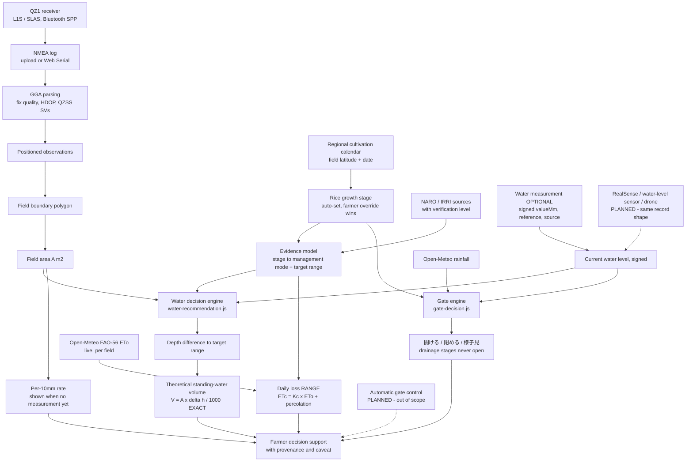

# Architecture

How スイスイナビ turns a QZSS/GNSS walk around a paddy into a water-management
decision, and where each part of that chain actually stands.

For the agronomic model itself see
[`PADDY_WATER_MANAGEMENT.md`](./PADDY_WATER_MANAGEMENT.md); for the evidence
behind every number see [`RESEARCH_REFERENCES.md`](./RESEARCH_REFERENCES.md).

---

## 1. System flow



Solid arrows are implemented. Dotted arrows are planned and named as such
everywhere in this repository.

---

## 2. Why QZSS/GNSS positioning matters to a water calculation

This is the link that makes a positioning project and a water-management
feature one system rather than two.

The volume calculation is:

```
V [m³] = A [m²] × Δh [mm] / 1000
```

`Δh` comes from agronomy. **`A` comes from the boundary the farmer walked with
the QZ1 receiver.** Area enters the result linearly, so a proportional error in
the mapped boundary is a proportional error in every litre figure the app
reports.

```
QZ1 NMEA → GGA fixes → boundary polygon → shoelace/Turf area → A → V = A × Δh / 1000
```

Concretely, for the worked example in
[`PADDY_WATER_MANAGEMENT.md`](./PADDY_WATER_MANAGEMENT.md) (2,143 m², 12–32 mm
deficit): a 5% area error moves the answer by roughly 1.3–3.4 m³. Better
boundary positioning is therefore not cosmetic — it is an input to the number
the farmer acts on.

### What this project can and cannot claim about accuracy

**We do not claim centimetre accuracy.** The hardware available was the blue
**QZ1 (L1S/SLAS)** receiver; no CLAS receiver was obtained. What the logs
actually establish:

- GGA `fix quality = 2` evidences **DGNSS state**. It does *not* by itself prove
  the correction source was SLAS, nor establish an absolute accuracy figure.
- `$GQGSV` sentences and GSA PRNs evidence **QZSS visibility and use** —
  separate evidence, recorded separately.
- The app stores fix quality, QZSS satellite counts, HDOP and the raw NMEA
  independently, and treats explicit SLAS state as **unconfirmed** until the
  receiver emits corroborating output.

The first real capture (2026-07-06, dormitory walk, ~7 min, at night beside
buildings) recorded 426 GGA sentences, of which 48 were DGNSS fixes. That is
evidence the pipeline works end to end. **It is not evidence of field-grade
accuracy** — an open paddy with synchronised QZ1/M10 logging is still required.

Area is computed with Turf.js where available, falling back to a local planar
shoelace approximation. Both are appropriate at single-paddy scale; neither
corrects for terrain slope, and neither is more accurate than the boundary fed
into it.

---

## 3. Module map

| Layer | Location | Responsibility |
|---|---|---|
| GNSS ingest | `js/gnss/` | NMEA parsing, fix-quality classification, session store |
| Live capture | `js/recording/` | Web Serial recording (Chrome/Edge desktop) |
| Field geometry | `js/fields/` | Boundary selection, `buildField()`, **area calculation** |
| Water evidence | `js/water/water-management-sources.js` | Source registry + verification level |
| Water model | `js/water/growth-stage-model.js` | Stage → mode → target range (no area) |
| Water measurement | `js/water/water-measurement.js` | Measurement record + legacy normalisation |
| Water engine | `js/water/water-recommendation.js` | Target → status → Δh → volume → provenance |
| Gate engine | `js/water/gate-decision.js` | **The single source of 開ける/閉める/様子見**, from stage + level + weather |
| Stage calendar | `js/water/growth-calendar.js` | Region (from field latitude) + date → suggested stage; manual always wins |
| Daily loss | `js/water/daily-loss.js` | `ETc = Kc × ETo` + percolation range, with its error bar |
| Legacy hero | `js/water/water-need.js` | Pre-existing cm-based 今日の水門判断 calculation |
| Cloud sync | `js/cloud/` | Supabase sync; records carried verbatim in a `record` column |
| Auth | `js/auth/` | Account scoping of per-farmer storage keys |
| Drone | `js/drone/`, `js/pilot/`, `backend/app/mavlink/` | Telemetry display (mock by default) |
| Edge perception | `edge/perception/` | RealSense capture + weed/pest detection |
| Presentation | `index.html` | Markup, wiring, rendering. **No agronomic arithmetic.** |

**Separation rule.** All depth/volume arithmetic lives in `js/water/*`, which is
DOM-free and unit-tested. `index.html` renders results and never computes them.

On desktop (≥981px) 基本モード renders as a floating map dashboard: the Leaflet
map is the full-bleed canvas of the workspace and the 圃場の管理/今日の水門判断 and
NMEA/測量ログ rails float above it as translucent cards, so map imagery stays
visible outside and between them. 設定, ドローンモード and mobile (≤980px) keep the
map + single scrollable panel shell unchanged. See
[`STAGE1_BASIC_FLOATING_MAP_DASHBOARD.md`](./STAGE1_BASIC_FLOATING_MAP_DASHBOARD.md).

---

## 4. Data and persistence

Local-first. Browser storage is the source of truth; Supabase sync is additive.

| Key | Shape |
|---|---|
| `suimonNaviCurrentWaterLevelV1` | `{ [fieldId]: { valueCm, recordedAt, valueMm, reference, source, measuredAt } }` |
| `suimonNaviFieldGrowthStageV1` | `{ [fieldId]: { stage, source, transplantedOn, variety, updatedAt } }` |
| `suimonNaviTargetWaterLevelV1` | `{ [fieldId]: number }` (legacy manual target) |

**Backward compatibility is a hard constraint.** The water-level key is
*extended, not replaced*: the legacy `valueCm`/`recordedAt` pair is still
written, so `water-need.js` and the existing hero read exactly what they always
did, and a pre-existing cm-only entry loads with no migration step. Cloud sync
carries whole local records verbatim in a `record` JSON column, so denormalised
columns can never corrupt a boundary.

**Known consequence (pre-existing):** `suimonNaviCurrentWaterLevelV1` is
deliberately *not* account-scoped, because real installs already hold unprefixed
values under that key and scoping it now would make a signed-in farmer's
existing readings unreachable without a migration. Water-level readings are
therefore visible across accounts on a shared device. Fixing it requires a
copy-on-first-scope migration.

---

## 5. Implementation status

Determined by reading the repository, not aspiration.

| Capability | Status |
|---|---|
| NMEA upload + GGA parsing (fix quality, HDOP, QZSS) | ✅ Implemented |
| Live Web Serial recording (desktop Chrome/Edge) | ✅ Implemented |
| Field boundary from GNSS observations | ✅ Implemented |
| Field area calculation (Turf + planar fallback) | ✅ Implemented |
| Boundary validation (closure gap, self-intersection) | ✅ Implemented |
| Manual water measurement with provenance + timestamp | ✅ Implemented |
| Growth-stage water recommendation | ✅ Implemented |
| Standing-water volume estimate (`V = A × Δh / 1000`) | ✅ Implemented |
| Research provenance surfaced in UI | ✅ Implemented |
| Rainfall-based gate advice (Open-Meteo) | ✅ Implemented |
| Accounts + cloud field sync (Supabase) | ✅ Implemented |
| Field observations, water points, reports, JSON export | ✅ Implemented |
| Drone MAVLink telemetry display | ✅ Implemented — mock by default; **no arm/takeoff/RTL/throttle** |
| RealSense edge perception (weed/pest detection) | 🧪 Experimental — separate Jetson pipeline, not wired to the web app |
| **RealSense automatic water-level measurement** | 🗓 Planned — **not implemented**; the record's `source` field is the hook |
| Signed water levels (soil-surface datum) | ✅ Implemented — see §6 |
| AWD-specific *recommendations* | 🗓 Planned — measurement only; no AWD agronomy |
| Weather-aware ET (`ETc = Kc × ETo`) | ✅ Implemented — live FAO-56 ETo from Open-Meteo × FAO 56 rice Kc |
| Daily-loss estimate (ETc + percolation range) | ✅ Implemented — reported as a RANGE, never merged with the geometric volume |
| Growth stage auto-set from regional calendar | ✅ Implemented — farmer override always wins |
| Gate verdict aware of stage + water level | ✅ Implemented — one engine feeds both cards |
| Automatic water-gate control | 🗓 Planned — deliberately out of scope |

Two deliberate scope exclusions, both for safety rather than difficulty:
physical gate automation (real irrigation infrastructure), and any flight
command path in the drone integration.

---

## 6. Signed water levels and the soil-surface datum

A water level is meaningless without saying what it is measured **from**, so
every measurement record names its datum explicitly.

```
reference: "soil-surface"

  valueMm  >  0    water surface ABOVE the soil surface (standing water)
  valueMm === 0    water surface exactly AT the soil surface
  valueMm  <  0    water level BELOW the soil surface (sub-surface water table)

   +50 mm  =  5 cm of standing water
     0 mm  =  water exactly at the soil surface
  -150 mm  =  water table 15 cm below the soil surface
```

The negative half of that range is not an edge case. It is where IRRI's
**safe-AWD** re-irrigation threshold lives — *"when the water level has dropped
to about 15 cm below the surface of the soil, irrigation should be applied"* —
i.e. exactly **−150 mm**. Before signed support, a farmer practising AWD could
not record the one measurement AWD is defined by.

**`+150` and `−150` are opposite field states about 30 cm apart.** The engine
therefore never compares depths with `Math.abs()` and never clamps a negative to
zero. With a target of 30–50 mm and a measurement of −150 mm:

```
deficit = 30 − (−150) = 180 mm   (to the bottom of the range)
          50 − (−150) = 200 mm   (to the top)
```

`Math.abs()` would turn −150 into +150 and report a field needing 180 mm of
water as one that is 100 mm too deep — inverting the advice. Clamping to zero
would under-report the deficit by exactly the sub-surface depth. Both are
pinned by tests.

### What this does and does not mean

**Implemented:** signed measurement. A negative water level can be recorded,
persisted, reloaded and compared correctly, and is displayed honestly.

**Not implemented:** AWD *agronomy*. Supporting the measurement is not the same
as supporting the management strategy. The growth-stage recommendation model is
unchanged — every stage keeps the target range its cited source supports, and
−150 mm has **not** become a target for anything. AWD and standing-water
growth-stage targets are different management concepts, and the app does not
have the evidence to recommend the former. See
[`RESEARCH_REFERENCES.md`](./RESEARCH_REFERENCES.md) §4.

### Both write paths agree

The two inputs are two views of one measurement, and this used to be a real
divergence:

| Path | Input | Before | Now |
|---|---|---|---|
| mm | 水管理 card | record rejected → entry **deleted** | valid record |
| cm | legacy 水位 (cm) | fallback stored `{ valueCm: -15 }`, no mm record | identical record |

One farmer action produced two different stored states, and the two cards
disagreed about whether a measurement existed at all. Typing **−15 cm** and
writing **−150 mm** now normalise to the same record.

### Backward compatibility

Legacy `{ valueCm, recordedAt }` entries load exactly as before. They carry no
`reference`, and are normalised **in memory** to `soil-surface` — which is what
the 水位 (cm) input always meant. **Stored rows are never rewritten to migrate
them.**

A record naming a datum this build does *not* know is reported as unreadable
rather than silently re-read against the soil surface: reinterpreting a reading
against the wrong datum is wrong by the offset between the two datums and looks
entirely plausible on screen.


## 7. Extension points

Each is a named seam that exists today, not a rewrite.

**Sensor-sourced measurement.** The engine only ever sees
`{ valueMm, reference, source, measuredAt }`. A RealSense, water-level-sensor or
drone integration writes a record with its own `source` and nothing downstream
changes — status, volume, staleness and provenance all work identically. Because
levels are signed (§6), a sensor observing a drained paddy can report a
sub-surface water table truthfully rather than having the reading discarded.

**Weather and evapotranspiration.** Rainfall is already fetched from Open-Meteo
for gate advice. FAO 56's `ETc = Kc × ETo` would extend the current geometric
number toward a water balance:

```
Irrigation requirement ≈ standing-water deficit + ETc + percolation/seepage − effective rainfall
```

**This formula is conceptual.** Nothing in this repository computes it. The app
deliberately reports only the geometric standing-water adjustment and states the
caveat, rather than presenting a fuller-looking number built on unmeasured
per-field percolation. NARO's 減水深 survey
([RESEARCH_REFERENCES §6](./RESEARCH_REFERENCES.md)) is the reason: with a
coefficient of variation above 70 across 851 fields, a borrowed loss constant
would be fabrication.

**Growth-stage prediction.** The stage record already stores `transplantedOn`
and `variety` without using them, and carries a `source` field alongside
`"manual"`. A future derivation from transplanting date, variety and accumulated
temperature — as NARO's own smart water-management software does via
メッシュ農業気象データ and a 水稲発育モデル
([RESEARCH_REFERENCES §3](./RESEARCH_REFERENCES.md)) — sets its own `source` and
changes nothing else. The farmer must always be able to override it.

**Automatic gate control.** NARO's software already drives 給排水バルブ制御 through
a 圃場水管理システム, so the direction is demonstrated rather than speculative.
It remains out of scope here: automating real irrigation infrastructure carries
responsibility and safety obligations beyond this project.

---

## 8. Hardware note

The project brief for the water feature names an **Intel RealSense "D345"**.
Intel's shipping RealSense depth line is **D4xx** (D405 / D415 / D435 / D435i /
D455); no D345 appears in it. No model number is hard-coded anywhere —
`edge/perception/camera/realsense.py` reads the model from the device at
runtime, and `js/water/water-measurement.js` says only "RealSense depth camera".

**This discrepancy is unresolved.** Confirm the physical unit before quoting a
model number in a demo or paper. This documentation does not assert D435.
