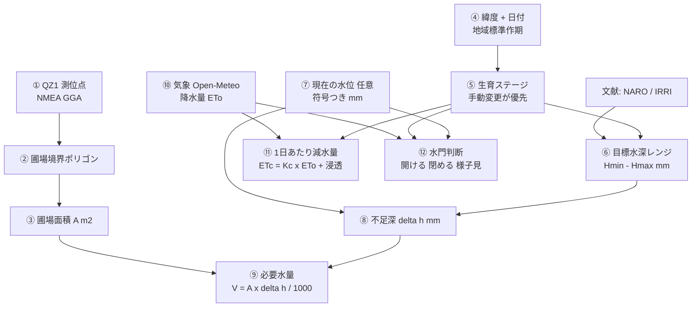

# 計算リファレンス / Calculation Reference

**発表用の計算根拠まとめ。** この文書は「画面に出ている数字は、どの式で、どの
データから、どの出典にもとづいて出たのか」を一つずつ追えるようにしたものです。

対象読者：発表資料を作る人／審査員／共同開発者。

> **読み方のルール**
> - **式** = 実際にコードが計算していること（該当ファイルを明記）
> - **出典** = その考え方や数値の根拠となる文献
> - **本プロジェクトの判断** = 出典そのものではなく、私たちが決めたこと
> - **限界** = その数字が保証しないこと
>
> この3つを混ぜないことが、この文書の一番の目的です。

---

## 0. 全体の流れ（1枚図）



**重要な前提（発表で必ず言うべき点）**

```
✗ 圃場面積 → 推奨水深      （科学的に誤り。面積は水深を決めない）
✓ 生育ステージ → 推奨水深
✓ 面積 × 水深差 → 必要水量
```

同じ生育ステージなら、2 ha の田も 2 a の田も**目標水深は同じ**です。
面積が変えるのは「必要な水の量」だけ。

---

## 1. GNSS測位点から圃場面積を求める

**実装：** `js/fields/field-annotation-core.js` → `polygonAreaSquareMeters()`

### 1.1 入力

QZ1受信機のNMEAログから `$GPGGA` / `$GNGGA` センテンスを解析し、
`fixValid` かつ緯度経度が有効な点だけを使います。farmerが選んだ開始点〜終了点
の範囲が境界の頂点列 `[[lat, lon], ...]` になります（3点以上必須）。

### 1.2 主計算 — Turf.js（測地線面積）

```js
const ring = coordinates.map(([lat, lon]) => [lon, lat]);  // GeoJSON は [経度, 緯度]
ring.push(ring[0]);                                        // 多角形を閉じる
area = turf.area(turf.polygon([ring]));                    // m²
```

Turf.js の `area()` は球面（測地線）多角形面積を計算します。単純な平面近似では
なく地球の曲率を考慮するため、緯度による経度収縮を自動的に扱います。

### 1.3 予備計算 — 局所平面 + 靴ひも公式

Turf.js が読み込めない環境では、局所平面に投影してから靴ひも公式（shoelace
formula）を使います。

**投影（1点目を原点とする局所直交座標）**

```
x = (lon − lon₀) × 111320 × cos(lat₀ · π/180)
y = (lat − lat₀) × 111320
```

`111320 m/度` は緯度1度あたりの子午線弧長の近似値。経度方向は
`cos(緯度)` を掛けて収縮を補正します。

**靴ひも公式**

```
A = ½ · | Σᵢ (xᵢ · yᵢ₊₁ − xᵢ₊₁ · yᵢ) |
```

### 1.4 実例（発表で使える数字）

```
田圃1 / paddy-001
  総ポイント        180点（DGPS fix 118 / GPS単独 62）
  面積              351 m² = 3.51 a = 0.0351 ha
```

### 1.5 なぜQZSSが効くのか（このプロジェクトの核心）

面積 A は必要水量の式に**線形**で入ります。

```
V = A × Δh / 1000
```

つまり **面積の誤差率 = 水量の誤差率**。境界測位の精度が、そのまま農作業で
使う数字の信頼性になります。

```
面積が5%ずれると → 水量も5%ずれる
351 m² の圃場で20 mmの入水なら 7.02 m³ → ±0.35 m³
```

**測位精度が農業の実務値に直結する** — これが測位と水管理を一つのシステムに
している理由です。

### 1.6 限界

- 傾斜地の**斜面補正はしていません**（水平投影面積）。棚田では実面積と差が出ます。
- 面積の精度は、入力した境界点の精度を超えません。
- **センチメートル精度は主張していません。** GGA fix quality `2` はDGNSS状態の
  証拠ですが、それだけでSLAS補正であることや絶対精度は証明できません。

---

## 2. 生育ステージの推定（地理＋季節）

**実装：** `js/water/growth-calendar.js`

### 2.1 なぜ必要か

毎回空のドロップダウンから選ばせるのは農家の負担です。日本の稲作暦は地域ごとに
かなり標準化されているため、**圃場の緯度＋今日の日付**から妥当な初期値を提示
できます。

### 2.2 地域の決定

圃場ポリゴンの**全頂点の平均緯度**を計算し、緯度帯で地域を選びます。

| 地域 | 緯度帯 |
|---|---|
| 北海道 | 41.4 – 46.0 |
| 東北 | 37.0 – 41.4 |
| 北陸・関東 | 35.6 – 37.0 |
| **近畿・東海** | **33.6 – 35.6** ← 本プロジェクトの圃場（奈良 ≈ 34.65°N） |
| 中国・四国・九州 | 30.0 – 33.6 |

### 2.3 日付からステージへ（近畿・東海の例）

| 期間 | ステージ |
|---|---|
| 05-15 – 06-04 | 移植前（代かき・整地） |
| 06-05 – 06-16 | 移植直後 |
| 06-17 – 06-26 | 活着期 |
| 06-27 – 07-25 | 分げつ期 |
| 07-26 – 08-05 | 中干し |
| 08-06 – 08-15 | 幼穂形成期 |
| 08-16 – 08-24 | 穂ばらみ期 |
| 08-25 – 09-04 | 出穂・開花期 |
| 09-05 – 10-05 | 登熟期 |
| 10-06 – 10-20 | 落水期 |

栽培期間外（およそ晩秋〜早春）は `unknown` を返します。1月の田に稲はないので
「推定できない」が正しい答えです。

### 2.4 出典と本プロジェクトの判断

**出典：** 農研機構スマート水管理ソフトは「全国の典型的な水管理暦に応じた
**7種類のテンプレート**」を備え、各期間の区切りを発育ステージに紐付けています。
地域テンプレート方式は確立された実務であり、本プロジェクトの発明ではありません。

**本プロジェクトの判断：** 上の日付表そのものは、一般的な一期作の作期を
参考に**本プロジェクトが設定した**ものです。特定文献の転記ではありません。

**限界（重要）：**
- 冷春・遅い移植・品種の違い・二期作はすべてこの推定を外します。
- 結果には必ず `source: "calendar"` と `isEstimate: true` が付き、UIは「推定」
  と明示します。
- **農家の手動選択が常に優先**され、後からカレンダーに上書きされることは
  ありません（`manualOverridesCalendar()` とそのテストで保証）。

---

## 3. 推奨水深（目標水深）の決定

**実装：** `js/water/growth-stage-model.js`

### 3.1 ステージ表（画面に出る数字そのもの）

| ステージ | 管理方法 | 目標水深 | 根拠 |
|---|---|---|---|
| 移植前（代かき・整地） | 代かき・整地に合わせた湛水 | **—** | 作業依存 |
| 移植直後 | やや深水管理 | **30–50 mm** | NARO図説, IRRI |
| 活着期 | やや深水管理 | **30–50 mm** | NARO図説, NARO浅水 |
| 分げつ期 | 浅水管理 | **25–35 mm** | NARO図説, NARO浅水 |
| 中干し | 落水・干し | **—** | NARO図説 |
| 幼穂形成期 | 間断灌漑 | **—** | NARO図説 |
| 穂ばらみ期 | 間断灌漑 | **—** | NARO図説 |
| 出穂・開花期 | 湛水管理 | **40–60 mm** | NARO図説, IRRI |
| 登熟期 | 飽水管理 | **—** | NARO図説 |
| 落水期 | 落水・干し | **—** | NARO図説 |

### 3.2 「—」は 0 mm ではない

これは発表で強調する価値のある設計判断です。

```
targetMinMm = null   ≠   targetMinMm = 0
「数値目標が存在しない」      「目標は0 mm」
```

中干し・落水期・登熟期・間断灌漑期は、**水深ではなく管理状態で判断する時期**
です。もし `null` を `0` として扱うと、

> 現在45 mm − 目標0 mm = 45 mm 超過 → 「96 m³ 排水してください」

という、乾かすべき田に対して真逆の指示が出ます。エンジンは数値比較の**前に**
この分岐を通ります。

### 3.3 数値の出どころ（逐語）

**分げつ期 25–35 mm** ← 農研機構図説の原文：

> 分げつ発生を促す**水深３ｃｍ前後**の浅水管理

「3 cm 前後」を 3 cm 中心の帯として 25–35 mm に符号化。出典が支持する以上に
幅を広げていません。

**移植直後・活着期 30–50 mm** ← 同図説の活着期：

> 日中止水で**３〜４ｃｍ**の浅水とし、水温を上昇させ、夜間は**５ｃｍ程度**の水深にする

**出穂・開花期 40–60 mm** ← 同図説の「水分補給を重視した**湛水（花水）**」に、
IRRIの "topping up to a depth of **5 cm** as needed" を併記して裏付け。

### 3.4 条件付き管理（自動選択しない）

低温・強風時は「浅水 → 深水」と判断が**逆転**します。この分岐はデータとして
保持し画面に表示しますが、**エンジンは自動選択しません** — 圃場ごとの信頼できる
気温履歴を持っていないためです。将来の気象連携の接続点です。

---

## 4. 現在の水位 — 符号と基準面

**実装：** `js/water/water-measurement.js`

### 4.1 基準面（datum）

水位は「何から測ったか」を言わないと意味がありません。全レコードが
`reference: "soil-surface"`（田面基準）を明示的に持ちます。

```
valueMm  >  0    田面より上（湛水）
valueMm === 0    田面ちょうど
valueMm  <  0    田面より下（地下水位）

  +50 mm  =  5 cm の湛水
    0 mm  =  田面と同じ高さ
 −150 mm  =  地下水位が田面より15 cm下
```

### 4.2 なぜ負値が必要か

IRRIの安全AWD（間断灌漑）の再入水しきい値がまさに負値です：

> "When the water level has dropped to about **15 cm below the surface of the
> soil**, irrigation should be applied to re-flood the field to a depth of about 5 cm."

つまり **−150 mm**。負値を拒否していた頃は、AWDを実践する農家が
「AWDを定義するその1つの計測値」を記録できませんでした。

### 4.3 絶対に混同してはいけない

```
+150 mm  と  −150 mm  は、約30 cm 離れた正反対の状態
```

そのためエンジンは水深比較に `Math.abs()` を**使わず**、負値を0に
**クランプもしません**（§5.2 参照）。

---

## 5. 必要水量の計算

**実装：** `js/water/water-recommendation.js`

### 5.1 基本の物理関係

```
1 mm の水  ×  1 m²  =  1 L
```

したがって

```
必要水量 [L]  = A [m²] × Δh [mm]
必要水量 [m³] = A [m²] × Δh [mm] / 1000
```

### 5.2 不足深 Δh（符号つき、絶対値を取らない）

```
belowBy = targetMinMm − currentMm      （下限までの不足）
aboveBy = currentMm   − targetMaxMm    （上限からの超過）
```

目標が範囲なので、必要水量も**範囲**で出ます。

```
Δh_min = targetMinMm − currentMm
Δh_max = targetMaxMm − currentMm
```

**符号の検証例（AWD）**

```
目標 30–50 mm、実測 −150 mm
  Δh_min = 30 − (−150) = 180 mm
  Δh_max = 50 − (−150) = 200 mm
```

> `Math.abs(−150)` としてしまうと `30 − 150 = −120` → 「120 mm 深すぎる」と
> なり、**助言が真逆に反転**します。0にクランプすると不足を150 mm 過小評価
> します。どちらも丸め誤差ではなく判断の誤りです。テストで固定しています。

### 5.3 実例（発表用の完全な計算）

```
圃場面積      2,143 m²         ← QZ1測量から算出
生育ステージ    移植直後（目標 30–50 mm、やや深水管理）
現在の水位     18 mm
不足深        30 − 18 = 12 mm  〜  50 − 18 = 32 mm

必要水量      2,143 × 12 = 25,716 L = 25.716 m³
             2,143 × 32 = 68,576 L = 68.576 m³

表示          25.7 〜 68.6 m³ ／ 25,716 〜 68,576 L
根拠          農研機構 図説：生育時期別の一般的な水管理
```

### 5.4 水位が未記録のとき — 「10 mmあたり」換算率

現在の水位を知らなければ不足深は計算できません。しかし**換算率は面積だけで
決まる**ので、測量済みならすぐ出せます。

```
volumePerTenMm(A) = A × 10 mm  [L]   =  A × 10 / 1000  [m³]

例：351 m² → 3,510 L = 3.51 m³ （水深10 mmあたり）
```

現在の水位について**何も仮定していない**のがポイントです。農家は自分が見た
深さを掛けるだけで済み、アプリは値を捏造しません。

### 5.5 限界（画面にも出している注意書き）

> この値は「湛水深を変えるのに必要な水量」の**理論値**です。実際の必要用水量は、
> 降雨・蒸発散・浸透・排水・圃場の均平・土壌条件・用水路の効率によって
> 変わります。灌漑量の確定値ではありません。

---

## 6. 1日あたりの減水量（ETc + 浸透）

**実装：** `js/water/daily-loss.js`

### 6.1 FAO-56 の作物係数法

```
ETc = Kc × ETo
```

- `ETo` = 基準蒸発散量 [mm/day]。**Open-Meteo から実測値を取得**
  （`et0_fao_evapotranspiration`）。FAO-56準拠の値がそのまま返るため、
  EToモデルを自前で再実装していません。
- `Kc` = 作物係数。生育段階で変化します。

### 6.2 水稲の Kc（FAO-56 Table 12 の逐語値）

```
Kc_ini = 1.05      Kc_mid = 1.20      Kc_end = 0.90 – 0.60
（最大草丈 1 m）
```

`0.90 / 0.60` はFAO自身が示す幅で、湛水を続けるか落水に向かうかで変わります。

**ステージへの割り当て（本プロジェクトの判断であり、FAOの指定ではありません）**

| ステージ | Kc |
|---|---|
| 移植前・移植直後・活着期 | 1.05 |
| 分げつ期 | 1.125 = (1.05 + 1.20) / 2 |
| 中干し・幼穂形成期・穂ばらみ期・出穂開花期 | 1.20 |
| 登熟期 | 0.90 |
| 落水期 | 0.60 |

### 6.3 浸透量（計算していません — 意図的に）

```
浸透量レンジ = 5 – 20 mm/day（代表値 12）
```

浸透は土性・耕盤・地下水位・排水条件で決まり、**アプリはそのどれも知りません**。
そこで「日本の水田が通常収まる範囲」を出典つきで提示し、この圃場の実測値では
ないと明示します。

### 6.4 合計（範囲として）

```
減水量_min = ETc + 5 mm/day
減水量_max = ETc + 20 mm/day

体積 [m³/day] = A [m²] × 減水量 [mm/day] / 1000
```

### 6.5 誤差 ±3 mm/day を明記する理由

```
ESTIMATION_ERROR_MM_PER_DAY = 3
```

**華山 謙 (1964)「減水深法の再検討」** は、減水深法による地域の水必要量推定に
**約 ±3 mm/day の不可避な誤差**があり、標本平均をその地域の必要量として扱う
慣行は妥当でないと結論しています。

さらに **福本・進藤 (2019)** の851圃場調査では期別減水深の**変動係数が 70.6–79.4**。

### 6.6 ★ 2つの数字を絶対に足し合わせない

これは発表で最も価値のある設計判断です。

| | 性質 |
|---|---|
| **① 必要水量**（§5） | `面積 × 水深差`。純粋な幾何計算。**厳密** |
| **② 1日あたり減水量**（§6） | `ETc + 浸透`。**範囲であり、不確実** |

足して1つの数字にすると、**厳密な値と誤差数mm/dayの推定値の和を、あたかも
全体が実測であるかのように**見せることになります。だから画面では別の行に
分けて表示します。

同じ理由で、NAROの 11.0–17.5 mm/day という調査値も**計算には自動適用せず**、
「日々の損失がこの程度ある」という**根拠**として示すだけにしています。
変動係数70超という事実が、それを定数扱いしてはいけない理由そのものです。

---

## 7. 水門の開閉判断

**実装：** `js/water/gate-decision.js`

### 7.1 なぜ独立したモジュールなのか（実際にあったバグ）

以前は降水量だけから判断しており、生育ステージも水位も見ていませんでした。
その結果：

```
中干し + 晴天5日  →  旧ロジック「開ける」
```

つまり**意図的に乾かしている田に「水を入れろ」**と指示していました。中干しは
土を固め、過剰分げつを抑え、根圏に酸素を供給するための期間です。落水期なら
コンバインに必要な地耐力まで失わせます。

修正はパッチではなく**構造的**に行いました：判断を持つ関数は1つだけで、
ステージ・水位・気象を同時に受け取ります。2つの画面が同じ関数を読む以上、
食い違いは起こり得ません。

### 7.2 判断順（先に一致したものが勝つ）

| # | 条件 | 判定 | 理由 |
|---|---|---|---|
| **1** | **落水系ステージ**（中干し・落水期） | **閉める** | 他の何よりも優先。乾かす期間に入水はしない |
| 2 | 直近24hの降水量 ≥ 20 mm | 閉める | すでに水が入っている |
| 3 | 水位が目標下限より低い | **開ける** | 作物の必要が予報に優先。雨は**時期の表現**だけを変える |
| 4 | 水位が目標上限より高い | 様子見 | **自動で排水を指示しない** |
| 5 | 水位未記録 | 気象のみで判断 | その旨を明示 |

**しきい値（設定で変更可）**

```
heavyRain24hMm      = 20 mm
lightRain24hMm      =  5 mm
forecastRainProbPct = 60 %
drySpellDays        =  3 日
```

### 7.3 ルール3がルール5に優先する理由（農学的判断）

出穂・開花期に**本当に水が足りていない**田を、「雨の予報が出ているから」と
いう理由で乾いたまま放置してはいけません。NAROの指導も出穂・開花期前後の
水不足をその季節の重大リスクとして扱っています。

予報が高いときは判定を覆さず、**文言だけ**を変えます：

```
降水確率81% → 「開ける」＋「降雨後に再確認」
```

### 7.4 このアプリが絶対にしないこと

**排水を指示しません。** 排水するかどうかはその年の管理方針に関わる人間の
判断であり、「水を落とせ」と誤って言うアプリの失敗は「現地を確認して」と
言うアプリの失敗よりはるかに重大です。

---

## 8. 出典一覧（確認状況つき）

書誌情報は出版元・リポジトリの記録から取得しています。確認できなかった項目は
捏造せず、機関ページを引用しています。

| # | 出典 | 確認 | 本アプリでの用途 |
|---|---|---|---|
| 1 | 農研機構 東北農業研究センター「図説：生育時期別の一般的な水管理」 | ✅ 本文確認 | **ステージ表の主根拠**（全ての水深値） |
| 2 | 同「図説：活着期から分げつ期の浅水管理のポイント」 | ✅ 本文確認 | 浅水管理の機構（水温日較差） |
| 3 | 農研機構「スマート水管理ソフト」2018成果情報 | ✅ 本文確認 | モデル構造の先例／将来構想の根拠 |
| 4 | IRRI Rice Knowledge Bank — Water management / Safe AWD | ✅ 本文確認 | 出穂開花期の裏付け／符号つき水位の定義 |
| 5 | 福本昌人・進藤惣治 (2019) | ✅ 本文確認 | 減水深のばらつき（定数化しない根拠） |
| 6 | 華山 謙 (1964)「減水深法の再検討」 | ✅ 本文確認 | 誤差 ±3 mm/day の明示 |
| 7 | FAO Irrigation and Drainage Paper 56 | ✅ 本文確認 | `ETc = Kc × ETo`、水稲Kc値 |
| 8 | MAFF 都道府県施肥基準等 掲載資料 | 🔗 リンクのみ | 補足。**数値の根拠には使用しない** |

### 詳細な書誌情報

**1. 図説：生育時期別の一般的な水管理**
農研機構 東北農業研究センター／シリーズ「図説：東北の稲作と冷害」／日本語
<https://agrimet.tarc.naro.go.jp/reigai/zusetu/kangai.html>
ページ自身が出典を明記：福島県稲作指導指針（総合版），平成４年３月，福島県農政部（一部改変）
> ⚠️ このページは `Shift_JIS` 配信です。UTF-8で素朴に取得すると文字化けします。

**限界：** 東北の**冷害対策**を前提とした一般論であり、全国標準でも固定の
スケジュールでもありません。地域・品種・年次で適正値は変わります。

**4. IRRI Rice Knowledge Bank**
International Rice Research Institute／英語
<http://www.knowledgebank.irri.org/step-by-step-production/growth/water-management>
<http://www.knowledgebank.irri.org/training/fact-sheets/water-management/saving-water-alternate-wetting-drying-awd>
**限界：** 主に熱帯アジア向けの指針であり、日本の栽培指導そのものではありません。

**5. 低平地水田における減水深の空間的ばらつき**
福本 昌人 (FUKUMOTO, Masato)・進藤 惣治 (SHINDO, Soji)
農研機構研究報告 農村工学研究部門 **3**: 1–12（2019-03-30）／ISSN 2432-7883
DOI [10.24514/00001146](https://doi.org/10.24514/00001146)（JaLC）
<https://repository.naro.go.jp/records/1181>
新潟県西蒲原地域・851調査圃場・6生育段階／期別減水深の平均 **11.0 → 17.5 mm/day**／
**変動係数 70.6–79.4**
**限界：** 特定地域・特定土壌の実測値であり普遍定数ではありません。

**6. 減水深法の再検討**
華山 謙／農業土木研究 **32**(1): 15–23（1964）
DOI [10.11408/jjsidre1929.32.15](https://doi.org/10.11408/jjsidre1929.32.15)／日本語

**7. Crop evapotranspiration — Guidelines for computing crop water requirements**
Allen, R.G., Pereira, L.S., Raes, D., Smith, M.／FAO Irrigation and Drainage Paper 56
FAO, Rome（1998）／ISBN 92-5-104219-5
<https://www.fao.org/4/x0490e/x0490e00.htm>
水稲Kc：Table 12

### 参考として調査したが、数値には使っていない文献

| 文献 | なぜ使わないか |
|---|---|
| Anbumozhi, Yamaji & Tabuchi (1998), *Agricultural Water Management* **37**(3): 241–253, DOI [10.1016/S0378-3774(98)00041-9](https://doi.org/10.1016/S0378-3774(98)00041-9)。0/3/6/9/12/15/18 cm の湛水処理、最適 9 cm | 「水深が生育に影響する」証拠としては有効。ただし9 cmは**その実験条件での**最適値であり、日本の推奨値として符号化してはいけません |
| 千葉雅大ほか (2009)「深水栽培による高品質米生産技術」日本作物学会紀事 **78**(4): 455–464, DOI [10.1626/jcs.78.455](https://doi.org/10.1626/jcs.78.455)。分げつ期に**18 cm** | 「唯一の正しい水深は存在しない」ことの最も明快な反証。NAROが分げつ期に約3 cmとする一方、本研究は同じ時期に18 cmを意図的に使い、目的が違えば両方正しい |
| Dong ほか (2020), *Irrigation and Drainage* **69**(S2): 61–74, DOI [10.1002/ird.2519](https://doi.org/10.1002/ird.2519) | 中国の制御灌漑のレビュー。管理**戦略**が判断単位であるという設計原則を支持 |

---

## 9. 発表で使えるまとめ

### 一言で

> **QZSS測位で測った圃場の形から面積を出し、生育ステージから農学的根拠のある
> 目標水深を提示し、その2つを掛けて必要な水量を計算する。水位の入力は任意で、
> 入れれば不足量と水門の開閉判断まで出る。**

### 数字の流れ（1例）

```
QZ1で180点測位 → 境界ポリゴン → 面積 351 m²
今日の日付 + 緯度34.65°N → 近畿・東海 → 分げつ期（推定・変更可）
分げつ期 → 目標水深 25–35 mm（浅水管理／NARO図説「水深３ｃｍ前後」）
水位未記録        → 「水深10 mmあたり 3.51 m³」
水位 10 mm を入力 → 不足 15–25 mm → 5.3–8.8 m³ → 水門「開ける」
```

### 技術的に自慢していい点（すべて検証済み）

1. **面積は水深を決めない** — 科学的に正しいモデル構造を、コードとテストで強制
2. **`null` ≠ `0`** — 数値目標がない時期に「0 mmだから入水」と誤らせない
3. **符号つき水位** — AWDの −150 mm を表現でき、`abs()` による反転をテストで禁止
4. **厳密値と推定値を足さない** — 誤差 ±3 mm/day を出典つきで明示
5. **落水期は何があっても開けない** — 気象より生育ステージが優先する構造
6. **すべての数値が出典まで追跡可能** — 画面 → ソース登録 → 書誌情報

### 正直に言うべき限界

- センチメートル精度は主張していません（QZ1 L1S/SLAS、CLAS受信機は未入手）
- 生育ステージは**推定**であり、農家の手動修正が常に優先
- 浸透量はこの圃場の実測値ではなく一般的な範囲
- 実際の灌漑量は理論値と異なります（降雨・排水・均平・用水路効率）
- 水門の**自動制御は意図的にスコープ外**（安全上の理由）

---

## 10. 関連ドキュメント

| ドキュメント | 内容 |
|---|---|
| [`ARCHITECTURE.md`](./ARCHITECTURE.md) | システム全体構成、実装状況、拡張点 |
| [`PADDY_WATER_MANAGEMENT.md`](./PADDY_WATER_MANAGEMENT.md) | 水管理モデルの詳細・永続化 |
| [`RESEARCH_REFERENCES.md`](./RESEARCH_REFERENCES.md) | 書誌情報の完全版・出典の解釈と限界 |
