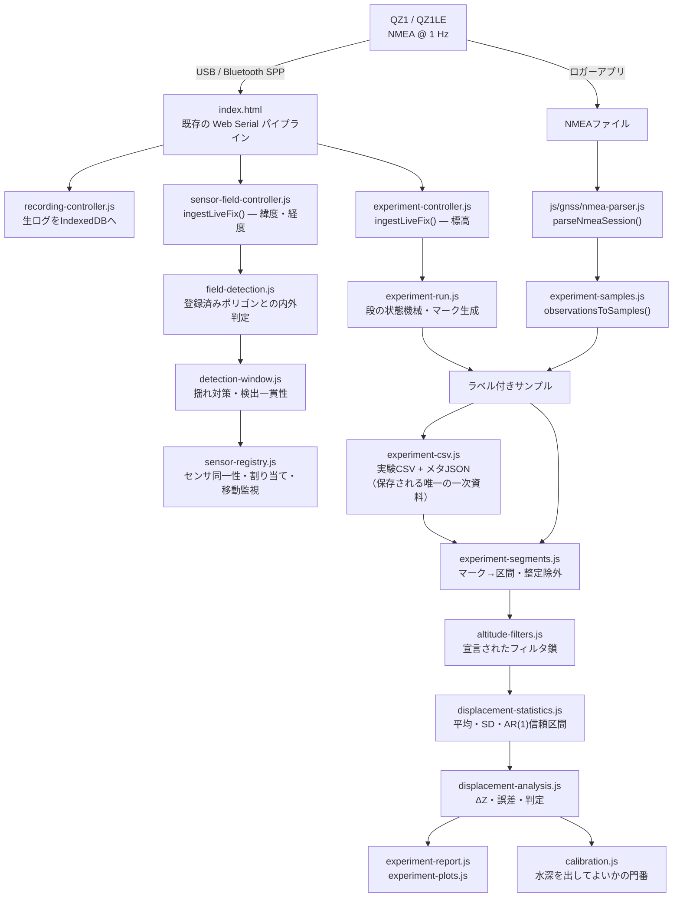

# Architecture — QZ1 Floating Water-Level Experiment

## 1. データの流れ / Data flow



**取得と解析は別プログラムです。** CLI（`analyze-experiment.mjs`）はシリアルポートに
触れず、記録を書き換えることもできません。同じログを1年後に別のフィルタで
再解析でき、元の数値は残ったままです。

## 2. 既存コードの再利用 / What is reused, and why nothing was duplicated

このリポジトリには既にGNSSスタックがあります。二つ目を作れば「受信機が何と
言ったか」の定義が二つになり、実験は受信機ではなく**自作パーサ同士の差**を
測ることになります。したがって:

| 既存 | 実験側での扱い |
|---|---|
| `js/gnss/nmea-parser.js` | **そのまま利用。** GGA/GSA/RMC/ZDA/GQGSV を解析し、標高・ジオイド高・fix・衛星数・HDOP/VDOP/PDOP・QZSS可視数・**生センテンス参照**まで出します。実験に必要な項目は全て既にここにあります |
| `js/gnss/nmea-file-intake.js` | ファイル受け入れ判定。変更なし |
| `index.html` の Web Serial | **そのまま利用。** 実験カードは自前でポートを開かず、`handleSerialLine()` が `ingestLiveFix()` を呼ぶだけの**リスナー**です。ページ上のシリアルパイプラインは1本 |
| `js/recording/*` | 生ログのIndexedDB保存・復旧。実験と独立に動き続けます |
| `js/water/water-measurement.js` | 水位記録の型・基準面・符号規約。較正済み水深はこの型で出します（`source: "qz1-float"`） |
| `js/fields/field-annotation-core.js` / `-controller.js` | **農家が登録した圃場ポリゴンの唯一の置き場所。** センサの圃場判定はここを読むだけで、2つ目の圃場データベースは作りません |
| 共有のLeaflet地図 | センサマーカーは自前のレイヤグループを共有地図に足します（`vegetation-controller.js` と同じ作法）。2つ目の地図は作りません |

新規モジュールは `js/qz1-water-level/` にまとめました（`js/gnss/`, `js/water/` と
同じ1ドメイン1ディレクトリの慣習）。

## 3. モジュール / Modules

| ファイル | 役割 | DOM |
|---|---|---|
| `experiment-config.js` | 実験の**設計**（高さ・滞在時間・整定時間・許容誤差）と検証 | なし |
| `experiment-samples.js` | 既存パーサ／ライブfix → 実験サンプルへの**変換のみ** | なし |
| `experiment-segments.js` | マーク（「t0〜t1はH mmだった」）→ 区間、整定窓の除外 | なし |
| `altitude-filters.js` | 宣言されたフィルタ鎖。段ごとの除去数と理由を記録 | なし |
| `displacement-statistics.js` | 記述統計＋AR(1)有効サンプル数による信頼区間 | なし |
| `displacement-analysis.js` | ΔZ・誤差・ヒステリシス・PASS/INCONCLUSIVE/FAIL判定 | なし |
| `experiment-csv.js` | 実験CSVの読み書き（RFC 4180） | なし |
| `experiment-plots.js` | 依存ライブラリなしのSVG作図 | なし |
| `experiment-report.js` | テキスト表・自己完結HTMLレポート | なし |
| `experiment-run.js` | ライブ実行の状態機械（時計は引数で渡す） | なし |
| `calibration.js` | H(t) = H0 + (Z(t) − Z0) と、**それを出してよいかの判断** | なし |
| `experiment-controller.js` | DOM・タイマー・ダウンロード**のみ** | あり |
| `field-boundary.js` | 2種類の圃場レコード形状から境界を読む | なし |
| `field-detection.js` | 点の内外判定（Turf優先・フォールバックあり） | なし |
| `detection-window.js` | GNSSの揺れに対するローリングウィンドウと検出一貫性 | なし |
| `sensor-registry.js` | センサ同一性・割り当て状態遷移・移動監視・履歴・永続化 | なし |
| `sensor-field-controller.js` | センサ欄のDOM・地図マーカー**のみ** | あり |

`recording-core.js` / `recording-controller.js` と同じ分割です。判断はすべて
DOMなし側にあり、単体テストで固定されています。

## 4. 5つの量を混ぜない / The five quantities never merge

| # | 量 | どこに | 何であるか |
|---|---|---|---|
| 1 | 生のGNSS標高 | `level.raw.meanMm` | 受信機が言った値 |
| 2 | フィルタ後標高 | `level.filtered.meanMm` | 1に、記録された鎖を適用した値 |
| 3 | 観測された相対変位 | `level.deltaGnssMm` | 2 − 基準位置の2 |
| 4 | 実際の基準変位 | `level.deltaReferenceMm` | 巻尺・水位標が言った値 |
| 5 | 誤差 | `level.errorMm` | 3 − 4 |

出力のどの数値についても「受信機が言ったのか、我々が計算したのか、巻尺が
言ったのか」に必ず答えられます。

## 5. 時計 / Clocks

| 経路 | `timestampUtcMs` | 理由 |
|---|---|---|
| ライブ（Web Serial） | **ホストPCの時計**（行の到着時刻） | 操作者の「位置に到達」マークも同じ時計で押されます。マークがホスト時計・サンプルがGNSS時刻だと、区間境界が両者の差だけずれます。GGA単独には日付がなく、日付を補うことは値の捏造です |
| オフライン（NMEAファイル） | **GNSS UTC**（RMC/ZDA由来） | ファイルには日付があります。この経路のマークも同じGNSS UTCで書く必要があります |

どちらの経路でも受信機自身の時刻は `gnss_time` 列に生のまま残り、後から突き合わせ
られます。

## 6. 統計上の判断 / Statistical decisions

**信頼区間は AR(1) 有効サンプル数で補正します。** 1 Hzの連続fixは独立ではありません
（マルチパスも大気遅延も秒ではなく分の単位で相関します）。素朴な sd/√n は300秒の
滞在を「300回の独立測定」と見なし、区間を約17倍狭めます。これはこのプロジェクトが
禁じている主張そのものです。

`n_eff = n·(1−r₁)/(1+r₁)` を使い、`n_eff < 2` になった場合は**区間を出しません**
（自由度が1を切り、t値が発散するため）。その段は `INSUFFICIENT` になり、
理由に「相関が強すぎる。滞在時間を延ばせ（フィルタでは解決しない）」と書かれます。

AR(1)自体が近似で、実際のGNSS誤差はラグ1より長い記憶を持ちます。**この区間は
不確かさの下限であって上限ではありません。** レポートは必ずそう書きます。

**平滑化は検出力を買えません。** 移動平均・移動中央値はサンプル間の相関を上げるので
`n_eff` が下がり、区間はむしろ**広がります**。見た目のばらつきだけが減ります。
平滑化を含む鎖には必ずその警告が付きます。

## 7. UI

`設定` → `QZ1測量` ワークスペース、`data-workspace="survey" data-mode="settings"`。

基本モードには置きません。三つの最上位モード（基本／ドローン／設定）は固定で、
QZ1測量はその下のワークスペースです。この実験カードは研究用計器であり、
農作業のワークフローには属しません。

較正済み水深の行は、`calibration.js` が許可した場合**のみ**数値を表示します。
通常は「表示できません」と、その理由が出ます。コントローラは水深を自前で
計算せず、迂回路も持ちません。

## 7.5 センサ同一性と圃場判定 / Sensor identity and field detection

センサは自分のIDだけを知り、圃場はスイスイナビが位置から判定します。
**標高実験とは独立** です。同じ測位点を2つの消費者が受け取り、互いに依存しません。

```text
1つの測位点
  ├─ 標高       → 鉛直変位の実験（結論がどうであれ）
  └─ 緯度・経度 → 圃場判定 → 割り当て（こちらは動き続ける）
```

`detectedFieldId`（観測・毎秒更新）と `assignedFieldId`（人の判断・ボタンでのみ変更）
は別概念で、食い違っても自動で書き換えません。

詳細・既定値・限界は [SENSOR_FIELD_ASSIGNMENT.md](SENSOR_FIELD_ASSIGNMENT.md)。

## 8. まだ実装していないもの / Deliberately not built

* LoRa / セルラー / クラウド連携 — 感知原理の検証が先です。既存のQZ1シリアル経路を
  使います。圃場割り当てのロジックは測位点しか見ないので、後で通信方式が
  USB / BLE / Wi-Fi / LoRa のどれになってもこの層は変わりません
* 自動較正 — 実験が裏付けるまで較正は手動かつ明示的
* 較正の永続化 — 実機実験の前に保存する価値がありません
* 基本モードへの露出 — 実験が成功した場合にのみ検討します
* 登録済み圃場カードへのセンサ表示・センサのプロジェクトJSON書き出し・測定レコードの
  永続化 — [SENSOR_FIELD_ASSIGNMENT.md §9](SENSOR_FIELD_ASSIGNMENT.md) に理由つきで
  next milestone として記載
